# GeneralBPC: Learned World + Relations + Macro Geometry

## v0.48: reproduced minimal physical closure boundary

The unchanged pure-BPC probability medium now couples aligned physical world
prediction to one external boundary bit.  It predicts in parallel whether the
boundary remains after each anonymous action and directly chooses the lowest
probability—without reward, a task score, search, a planner, or evaluation
learning.

The preregistered development run and its one authorized fresh-seed frozen
reproduction both passed every gate.  Frozen strict selection was **512/512
(100%)**, including **100% in every physical orientation**. Removing the port
carrier reduced selection to 0%; zeroing the spatial condition channel reduced
it to 16.21%. Non-port world-prediction Brier remained 0.00307 and evaluation
writes remained zero. See [the result](V48_ALIGNED_BOUNDARY_FROZEN_RESULT.md)
and [raw evidence](artifacts/v48aligned_boundary/frozen.json).

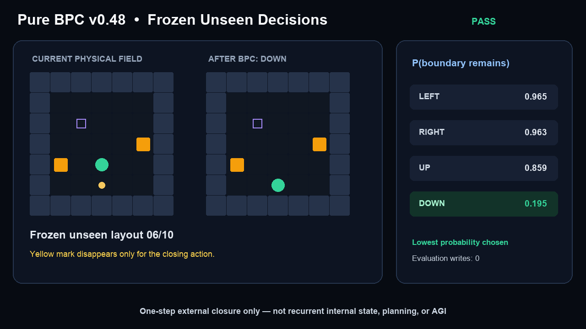

**[Watch ten frozen unseen decisions](https://github.com/JoffeeLin/bpc-sokoban-demo/releases/download/v48.0.0/bpc_v48_aligned_boundary.mp4)**

This is reproducible one-step external closure, not yet a recurrent internal
state with zero/flip ablation, long-process behavior, general Sokoban solving,
or AGI.

## v0.47: aligned phase-one reproduction

v0.47 corrects the camera-stride defect discovered after v0.44 and preserves
the old serializer unchanged for auditability. Board coordinate `(x,y)` now
maps to byte `y*8+x`; explicit tests verify row padding, real physical
neighbors and rotation correspondence.

Both the preregistered development run and its one authorized fresh-seed frozen
reproduction passed every fixed gate. In the frozen run, 39.79% of full local
contexts were unseen; changed-bit Brier was 0.04646 and unseen-changed Brier was
0.06478. The candidate improved over action removal by 83.52% and 78.98% on
those subsets, used 11,803 active addresses for 2,735 unique training states,
and made zero evaluation writes. See
[the frozen result](V47_ALIGNED_PHASE1_FROZEN_RESULT.md) and
[`artifacts/v47aligned/frozen.json`](artifacts/v47aligned/frozen.json).

This restores reproducible evidence for aligned one-step Sokoban-world physics
prediction. It does **not** establish goal behavior, Sokoban solving,
cross-domain transfer or AGI.

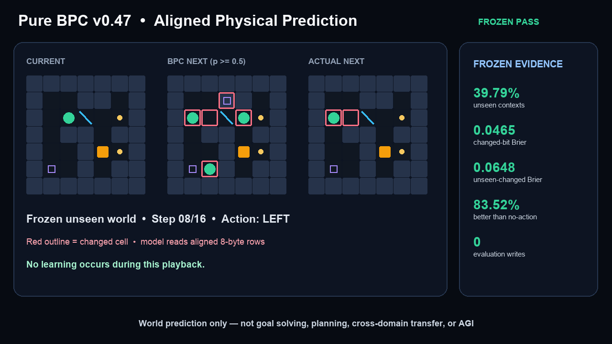

**[Watch the 12-second frozen prediction video](https://github.com/JoffeeLin/bpc-sokoban-demo/releases/download/v47.0.0/bpc_v47_aligned_prediction.mp4)**

## Archived v0.44: numerical result with a geometry defect

> **Post-publication audit (2026-09-23):** the Sokoban camera packed 7x7 pixels
> contiguously while local stencils assumed an 8-cell row stride. Its numerical
> result remains reproducible byte-interface prediction, but its 2D axis-local
> interpretation is invalid. The 8x8 causal-lattice track is unaffected. See
> [the geometry audit](V44_GEOMETRY_AUDIT.md). Do not treat v0.44 as confirmed
> two-domain spatial physics; aligned-camera v0.47 revalidation is required.

This historical line removed the earlier hand-named factor/field/memory stack and
tests one fixed non-neural probability medium on anonymous bytes, anonymous
actions and real next bytes. It uses center and axis-local physical stencils,
parallel action posteriors and Beta residual writeback. There is no reward,
planner, search, neural network, semantic selector or evaluation learning.

The first frozen execution used fresh worlds excluded from all development and
diagnostic data. Both serialized tracks passed their preregistered numerical
gates, but the Sokoban spatial interpretation was later invalidated:

| Frozen holdout | Sokoban physics | Causal particle lattice |
|---|---:|---:|
| unseen full local contexts | **40.28%** | **55.90%** |
| changed-bit Brier | **0.1849** | **0.0405** |
| unseen-context changed-bit Brier | **0.2314** | **0.0417** |
| active medium cells | **10,885** | **14,000** |

The second domain improved 86.35% over action removal, 94.93% over action
rotation and 95.40% over a physical terrain-phase flip on unseen changed bits.
Removing exact 3x3 storage reduced active occupancy by 91.84% and 97.84%
relative to the failed predecessors while preserving the held-out effects.

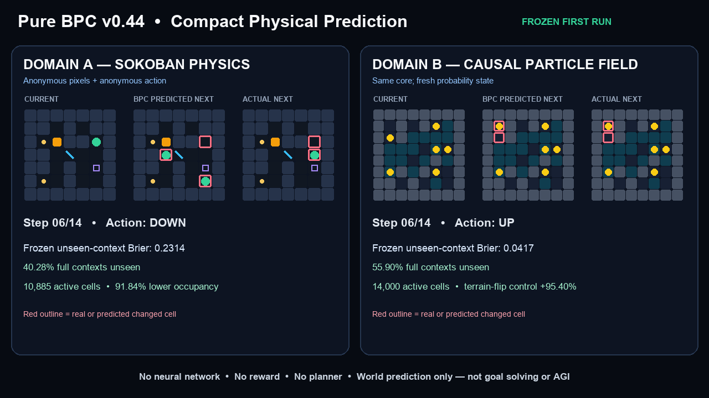

**[Watch the 12-second real-prediction video](https://github.com/JoffeeLin/bpc-sokoban-demo/releases/download/v44.0.0/bpc_v44_cross_domain.mp4)**

See the [frozen result](V44_COMPRESSED_CROSS_DOMAIN_RESULT.md),
[preregistration](V44_COMPRESSED_CROSS_DOMAIN_PREREG.md),
[machine-readable evidence](artifacts/v44compressed/cross_domain.json), and
[compact core](bpc_compressed_medium_v44.py).

This is retained as an auditable historical result, not as confirmed two-domain
spatial prediction, goal-directed Sokoban solving, cross-domain transfer, or AGI.

## v0.20 breakthrough: stochastic actuator-channel transfer

The frozen non-neural controller now identifies a previously unseen probability
channel from anonymous actuator slots to four physical effects while also
recovering anonymous sensor planes, a D4 spatial gauge class, and an end-to-end
sensorimotor lag.  It learns from raw unlabeled transitions and feeds the
unchanged BPC action probabilities backward through the recovered channel; no
planner or runtime search is added.

Four new stochastic matrices, four new spatial frames, unseen total lags `2`
and `4`, and 48 disjoint independent-generator worlds were frozen before
execution.  All **4/4** lags and **12/12** independent-stream lags were exact.
Maximum channel total-variation error was **2.58%** overall and **4.15%** on an
individual stream.  Across 4,608 held-out episodes, learned stochastic binding
completed **3,875 (84.1%)**, versus oracle 3,871, identity 2,480, and shuffled
rows 1,569.  All 13 gates passed with zero evaluation writes.  See
[`V20_STOCHASTIC_CHANNEL_RESULT.md`](V20_STOCHASTIC_CHANNEL_RESULT.md) and the
[`machine-readable result`](artifacts/v20stochastic/result.json).

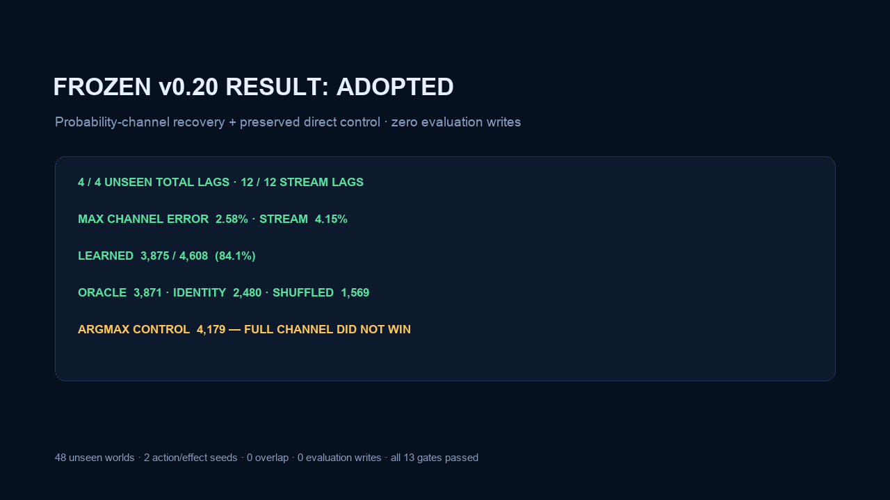

**[Watch 12 frozen stochastic-control traces](https://github.com/JoffeeLin/bpc-sokoban-demo/releases/download/v20.0.0/bpc_stochastic_channel_v20_12_unseen_worlds.mp4)**

The learned full probability channel did **not** beat its deterministic argmax
control (4,179 successes).  v0.20 supports probability-channel recovery and
robust control, not a claim that modeling stochasticity improved the best
controller.  It remains bounded developer-frozen synthetic evidence, not AGI.

## v0.19 breakthrough: end-to-end temporal gauge transfer

The frozen non-neural controller now infers an unknown sensorimotor lag jointly
with anonymous sensor planes, actuator slots, and a D4 spatial frame. Sensor
latency and actuator latency are not separately identifiable from observation/
action sequences: only their sum is. v0.19 therefore marginalizes every D4
gauge and action injection inside each supplied total-lag candidate `0–4`, then
keeps the identifiable temporal equivalence class instead of inventing a
physical decomposition.

Four new variable interfaces, four new spatial frames, held-out nuisance
families, and unseen total lags `2` and `4` were frozen before execution. Each
lag used two distinct physical decompositions: `0+2` / `1+1` and `0+4` / `2+2`.
All **4/4** lags, **16/16** independent-stream lags, **32/32** temporal-spatial
gauge/action pairs, and **128/128** per-stream pairs were recovered. Across
9,216 held-out episodes, the learned temporal gauge completed **8,552 (92.8%)**,
versus oracle 8,532, zero-lag alignment 1,182, one-step-shifted history 1,145,
and fixed random binding 1,809. Every interface and all 14 gates passed with
zero evaluation writes. See [`V19_TEMPORAL_GAUGE_RESULT.md`](V19_TEMPORAL_GAUGE_RESULT.md)
and the [`machine-readable result`](artifacts/v19temporal/result.json).

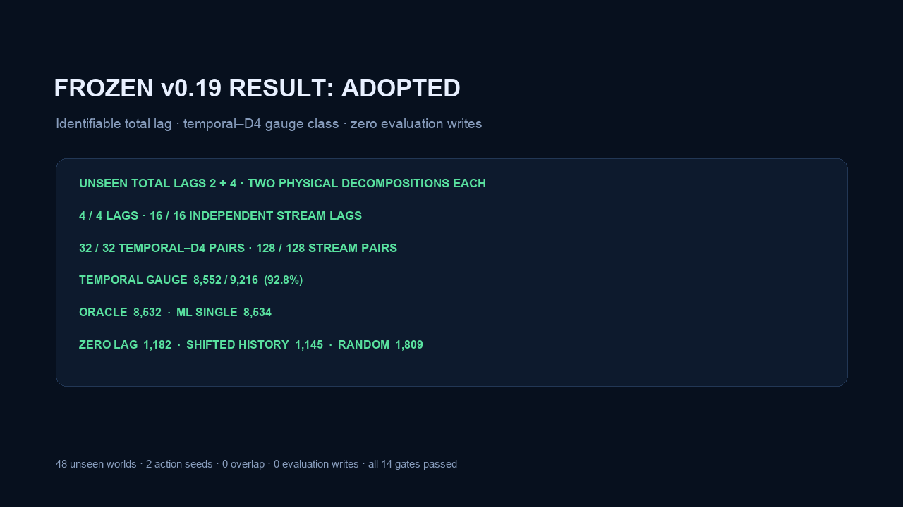

**[Watch 12 frozen delayed-control traces across four unseen temporal gauges](https://github.com/JoffeeLin/bpc-sokoban-demo/releases/download/v19.0.0/bpc_temporal_gauge_v19_12_unseen_worlds.mp4)**

This is bounded developer-frozen synthetic evidence, not arbitrary temporal
reasoning or AGI. The lag candidate family, D4 family, canonical ontology,
maximum canvas, statistics, generators, terminal events, and direct policy
remain supplied.

## v0.18 breakthrough: spatial gauge-class transfer

The frozen non-neural controller now transfers across an unknown rotation or
reflection of its complete sensor field while sensor planes and actuator slots
also change. Because directions and actions are both anonymous, absolute
orientation is not identifiable: any D4 transform can be compensated by one
actuator permutation. v0.18 learns that full equivalence class from unlabeled
transitions and averages the eight paired direct-action probabilities. It does
not select a frame by task success and uses no runtime planner or search.

Four new 9–12 sensor / 5–8 action interfaces, four non-identity D4 transforms
absent as actual transforms in development, held-out nuisance families, 48
disjoint independent-generator worlds, and two action seeds were frozen before
execution. All **32/32** gauge-action pairs and **128/128** independent-stream
pairs were behaviorally equivalent. Across 9,216 held-out episodes, gauge
averaging completed **8,339 (90.5%)**, versus oracle 8,367, a same-information
shuffled-pair control 5,253, no spatial restoration 4,170, and fixed random
binding 900. Every interface passed separately; all 12 gates passed with zero
evaluation writes. See [`V18_SPATIAL_GAUGE_RESULT.md`](V18_SPATIAL_GAUGE_RESULT.md)
and the [`machine-readable result`](artifacts/v18spatial/result.json).

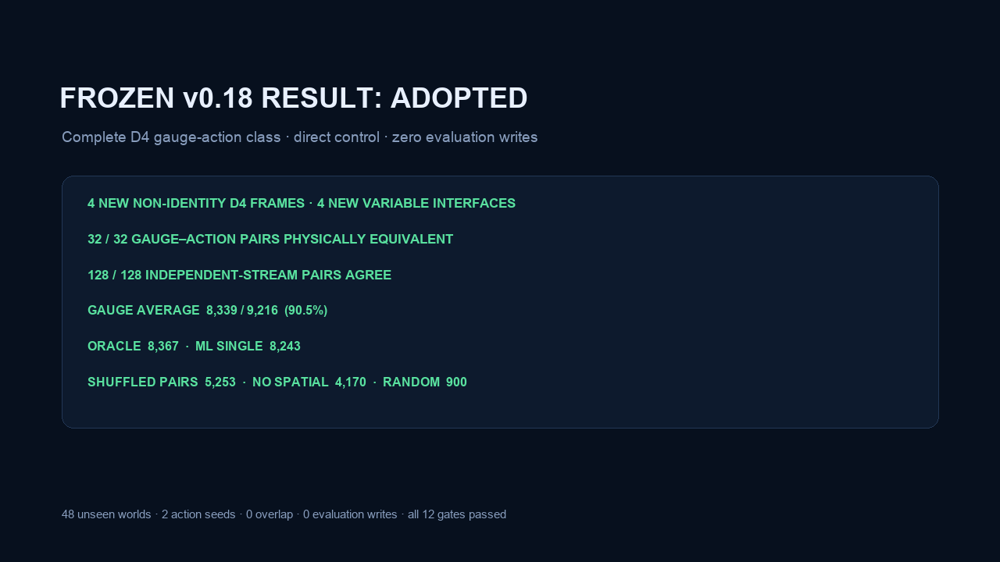

**[Watch 12 frozen traces across four unseen D4 frames and variable interfaces](https://github.com/JoffeeLin/bpc-sokoban-demo/releases/download/v18.0.0/bpc_spatial_gauge_v18_12_unseen_worlds.mp4)**

This is bounded developer-frozen synthetic evidence, not arbitrary visual
grounding or AGI. The D4 candidate family, canonical ontology, maximum canvas,
statistics, generators, terminal events, and direct policy remain supplied.

## v0.17 breakthrough: cross-generator variable-interface transfer

The frozen non-neural controller now transfers from its original square-map
training generator to a separately implemented rectangular-map generator while
simultaneously recovering a variable anonymous interface: 9–12 sensor planes
and 5–8 actuator slots around its canonical `6 × 4` policy. Extra sensors use
composite formula families held out from development. Extra actuators are
non-null—they change nuisance planes while leaving the canonical world alone.

Anonymous change support and bidirectional same-cell conditional support reduce
the four sensor assignment spaces from `60,480–665,280` candidates to four
bases each. Probabilities from four unlabeled regimes choose the oracle basis.
All four sensor and action mappings were exact, and all 16 individual streams
agreed. Across 2,304 joint episodes on 48 disjoint worlds from the independent
generator, learned binding matched oracle at **1,879 (81.6%)**, versus 83 with
only sensor binding, 780 with only action binding, 227 with identity binding,
and 309 with fixed random binding. All 16 gates passed with zero evaluation
writes. See [`V17_CROSS_GENERATOR_RESULT.md`](V17_CROSS_GENERATOR_RESULT.md)
and the [`machine-readable result`](artifacts/v17crossgen/result.json).

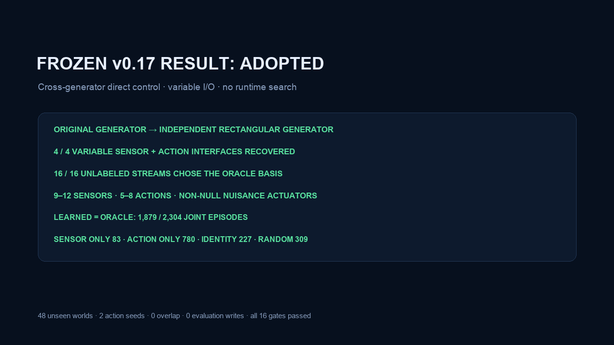

**[Watch 12 frozen traces across four variable interfaces and independent-generator worlds](https://github.com/JoffeeLin/bpc-sokoban-demo/releases/download/v17.0.0/bpc_cross_generator_v17_12_unseen_worlds.mp4)**

This is bounded synthetic cross-generator transfer, not arbitrary simulator
transfer. The task ontology, canonical schema, maximum canvas, distractor
family, structural statistics, generators, and goals remain supplied; it is
not autonomous grounding or AGI.

## v0.16 breakthrough: composite-distractor rejection

The frozen non-neural controller now recovers its canonical six-sensor/four-
action interface when two extra sensor planes are causally composed,
displaced-XOR distractors—not merely random nuisance planes. Empirical
transition-support invariance reduces each `8P6 = 20,160` sensor assignment
space to four compatible bases; probabilities across four separately sampled
unlabeled regimes select the correct one. The unchanged policy then acts
directly, with no runtime planner or search.

Four new composite interfaces were frozen before holdout execution. All exact
sensor and actuator mappings were recovered, and all 16 individual calibration
streams independently chose the oracle sensor basis. Across 2,304 joint
episodes, learned binding matched the oracle at **1,844 (80.0%)**, versus 169
with only sensor binding, 435 with only actuator binding, 161 with identity
binding, and 125 with fixed random binding. All 16 gates passed with zero
evaluation writes. See [`V16_COMPOSITE_BINDING_RESULT.md`](V16_COMPOSITE_BINDING_RESULT.md)
and the [`machine-readable result`](artifacts/v16composite/result.json).

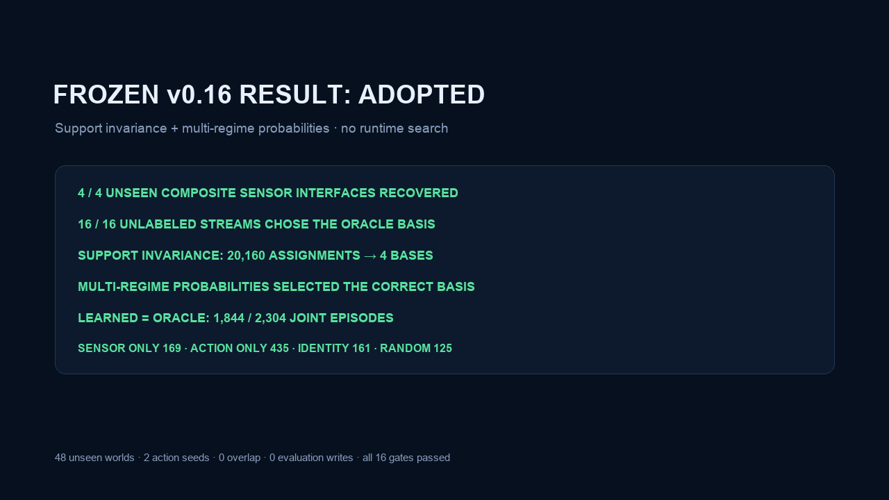

**[Watch 12 frozen traces across four unseen composite interfaces](https://github.com/JoffeeLin/bpc-sokoban-demo/releases/download/v16.0.0/bpc_composite_binding_v16_12_unseen_worlds.mp4)**

This resolves the specific displaced-XOR failure retained by v0.15, not
arbitrary grounding. The composite formula, four calibration regimes,
transition-support rule, likelihood family, generators, and terminal events
remain supplied; this is bounded synthetic evidence, not AGI.

## v0.15 breakthrough: canonical sub-interface discovery

The frozen direct controller can now locate its canonical six-sensor/four-action
interface inside unseen eight-channel/six-slot interfaces. Two extra sensor
planes are deterministic state-keyed random nuisances and two extra actuator
slots have permanent zero effect. Unlabeled transition probabilities select and
order the useful sub-interface before the unchanged policy acts; there is no
runtime planner or search.

Four new open interfaces were frozen before holdout execution. All exact sensor
and actuator subsets were recovered, and all eight null action slots were
rejected. Across 2,304 joint episodes, learned binding matched the oracle at
**1,651 (71.7%)**, versus 3 with only the sensor subset, 282 with only the
actuator subset, 103 with first-slot binding, and 179 with fixed random subsets.
All 14 gates passed with zero evaluation writes. See
[`V15_OPEN_INTERFACE_RESULT.md`](V15_OPEN_INTERFACE_RESULT.md) and the
[`machine-readable result`](artifacts/v15open/result.json).

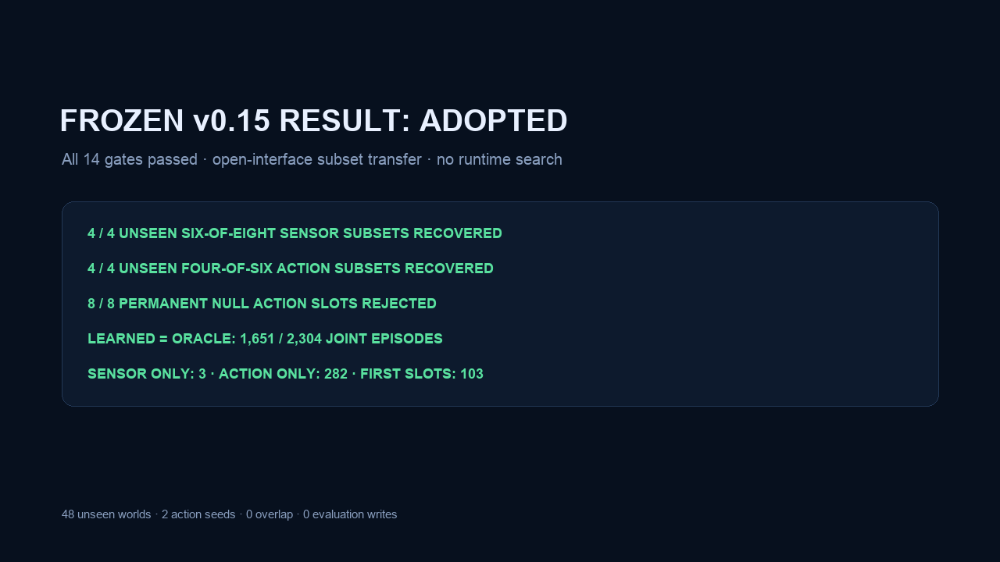

**[Watch 12 frozen traces across four unseen open interfaces](https://github.com/JoffeeLin/bpc-sokoban-demo/releases/download/v15.0.0/bpc_open_interface_v15_12_unseen_worlds.mp4)**

This claim excludes a retained negative result: causally composed distractor
planes were not identified reliably under mixture shift. The positive evidence
is limited to state-keyed random nuisances and permanent-null action slots; it
is not arbitrary grounding or AGI.

## v0.14 breakthrough: joint sensor and actuator binding

The frozen direct controller can now recover simultaneous unseen permutations
on both sides of its interface. From unlabeled random transitions, one
probability binder canonicalizes six anonymous sensor planes and a second maps
the policy's four canonical probability outputs to anonymous actuator slots.
The policy itself is unchanged and uses no runtime planner or search.

Four sensor derangements and four actuator derangements were frozen before
execution. All eight exact assignments were recovered under three shifted and
one balanced calibration distribution. Across 2,304 joint episodes, learned
binding matched the oracle at **1,509 (65.5%)**, versus 79 with only the sensor
binding, 297 with only the actuator binding, 222 with no binding, and 144 with
fixed random bindings. All 13 gates passed with zero evaluation writes. See
[`V14_JOINT_BINDING_RESULT.md`](V14_JOINT_BINDING_RESULT.md) and the
[`machine-readable result`](artifacts/v14joint/result.json).

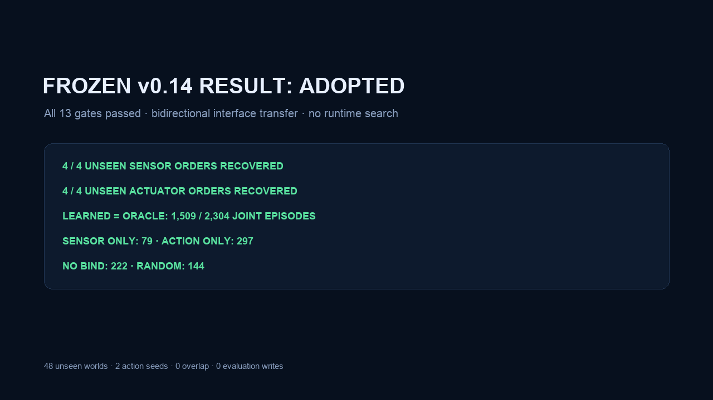

**[Watch 12 frozen traces across four dual-permuted interfaces](https://github.com/JoffeeLin/bpc-sokoban-demo/releases/download/v14.0.0/bpc_joint_binding_v14_12_unseen_worlds.mp4)**

This is bounded synthetic bidirectional-interface transfer. Cardinalities,
coordinate grid, calibration samplers, likelihood families, generators, and
terminal events remain supplied; it is not arbitrary grounding or AGI.

## v0.13 breakthrough: anonymous sensor-interface binding

The frozen v0.12 direct controller no longer requires its six raw input planes
to arrive in the training order. A non-neural probability binder observes
unlabeled random transitions, evaluates all `6!` one-to-one assignments, and
canonicalizes an unseen sensor order before the unchanged policy acts.

Four channel derangements were frozen before execution. Three calibration
streams also changed the mechanism mixture from balanced to `70/15/15`. The
transition binder recovered **4/4 exact mappings** and matched the oracle on
every interface, seed, and task. On 2,304 joint episodes it completed
**1,884 (81.8%)**, versus 1,529 for static statistics, 1,489 for count-only,
369 for random bindings, and 288 with no binding. All 12 gates passed with zero
evaluation writes. See [`V13_CHANNEL_BINDING_RESULT.md`](V13_CHANNEL_BINDING_RESULT.md)
and the [`machine-readable result`](artifacts/v13binding/result.json).

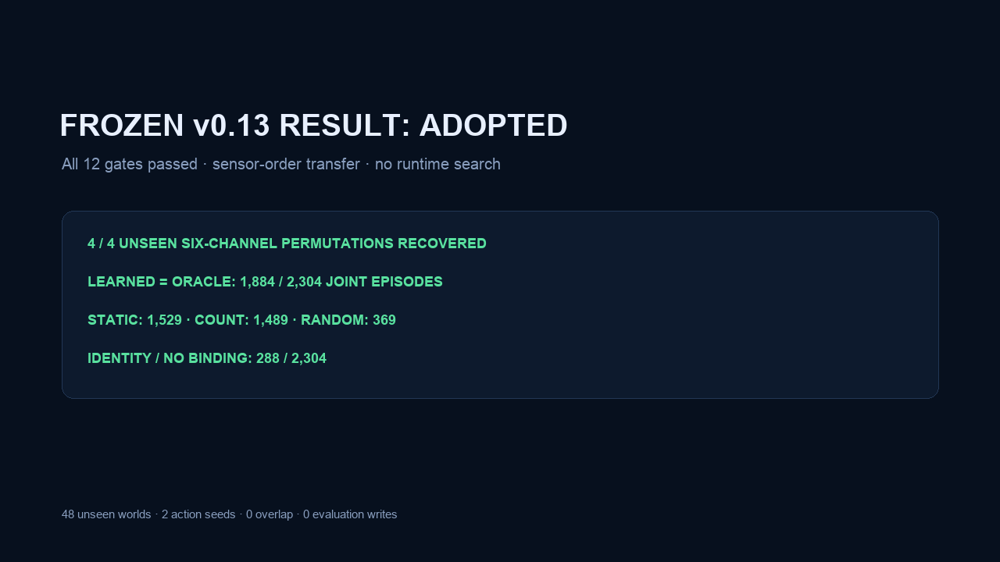

**[Watch 12 frozen traces across four unseen sensor interfaces](https://github.com/JoffeeLin/bpc-sokoban-demo/releases/download/v13.0.0/bpc_channel_binding_v13_12_unseen_worlds.mp4)**

**[View the v0.13 result and video on X](https://x.com/JoffeeLin/status/2101735002530808037)**

This is bounded synthetic sensor-interface transfer. The channel count,
calibration sampler, transition likelihood family, generators, and terminal
events remain supplied; it is not arbitrary grounding or AGI.

## v0.12 breakthrough: three learned factors recombine directly

One non-neural BPC learner now discovers three anonymous terminal raw-change
factors from separate experience streams, then uses one additive evidence query
to recombine them on unseen worlds requiring a switch, gate, box push, and
target collection. It receives no task-family name and has no joint-task
training, runtime planner, or search.

Across 12 frozen joint worlds, two new action seeds, and 768 trials at 64 steps,
the BPC field completed **574/768 (74.7%)**. The same-information explicit
product also completed 574; one shared cube completed 437; fixed deletion of
the three anonymous factors completed 474, 297, and 487; uniform random
completed 139; rotated action semantics completed 6. All 13 pre-registered
gates passed with zero evaluation writes. See
[`V12_THREE_FACTOR_RESULT.md`](V12_THREE_FACTOR_RESULT.md) and the
[`machine-readable result`](artifacts/v12three/result.json).

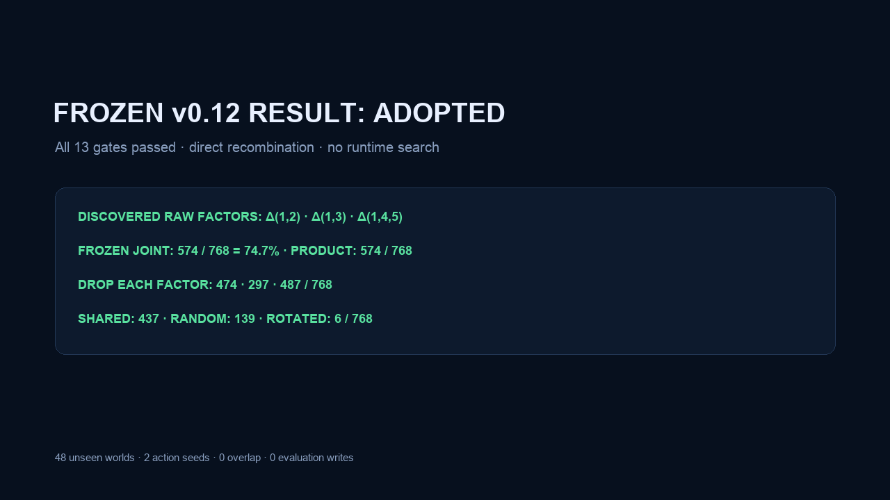

**[Watch 12 frozen unseen joint traces](https://github.com/JoffeeLin/bpc-sokoban-demo/releases/download/v12.0.0/bpc_three_factor_v12_12_unseen_joint_worlds.mp4)**

**[View the v0.12 video and result thread on X](https://x.com/JoffeeLin/status/2101727094967603654)**

This is bounded developer-frozen synthetic evidence. Raw channels, terminal
events, the additive field rule, generators, and limits remain supplied; it is
not autonomous operator invention or AGI.

## v0.10 breakthrough: anonymous factor discovery without task names

One BPC learner now separates successful experience by the raw bit planes that
co-change on the terminal transition. It removes the plane shared by all
discovered factors, then activates factors from the remaining raw-plane
presence—without receiving `push`, `collect`, or another task-family label.

On 48 frozen, non-overlapping worlds and two new action seeds, automatic routing
matched a task-name oracle on all **342,139** routing decisions and completed
**4,284/6,144** 32-step episodes. Permuting the discovered raw-plane bindings
fell to **2,749/6,144**; the shared mixed-trace cube completed **3,962/6,144**.
See [`V10_AUTOFACTOR_RESULT.md`](V10_AUTOFACTOR_RESULT.md) and the
[`machine-readable result`](artifacts/v10autofactor/result.json).

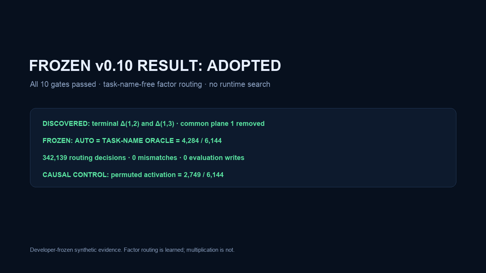

**[Watch 12 frozen task-name-free traces](https://github.com/JoffeeLin/bpc-sokoban-demo/releases/download/v10.0.0/bpc_autofactor_v10_12_unseen_worlds.mp4)**

**[View the v0.10 result and video on X](https://x.com/JoffeeLin/status/2101720963033497708)**

Always activating both factors was slightly higher at `4,302/6,144`. The
supported advance is removal of task labels from factor discovery/routing, not
a routing performance gain. Equal probability multiplication and terminal
success events remain supplied; this is not autonomous operator invention or
AGI.

## v0.9 breakthrough: direct task composition without joint training

Two independent BPC policies learn from `2,000` push-only and `2,000`
collect-only episodes. Their four-way probabilities are multiplied equally at
inference, then sampled directly—no runtime planner, search, joint-task
training, or evaluation writes.

All 16 frozen worlds require pushing: they become unsolvable if boxes are held
fixed. Under a 32-step budget:

| Frozen condition | Successes | Rate |
|---|---:|---:|
| Independent probability product | **942 / 2,048** | **46.0%** |
| Collect-only specialist | 830 / 2,048 | 40.5% |
| Shared mixed-experience cube | 610 / 2,048 | 29.8% |
| Uniform random | 235 / 2,048 | 11.5% |
| Rotated learned actions | 71 / 2,048 | 3.5% |

Every new world had a successful direct-control trace. See
[`V09_DIRECT_RESULT.md`](V09_DIRECT_RESULT.md) and the machine-readable
[`v0.9 result`](artifacts/v09direct/result.json).

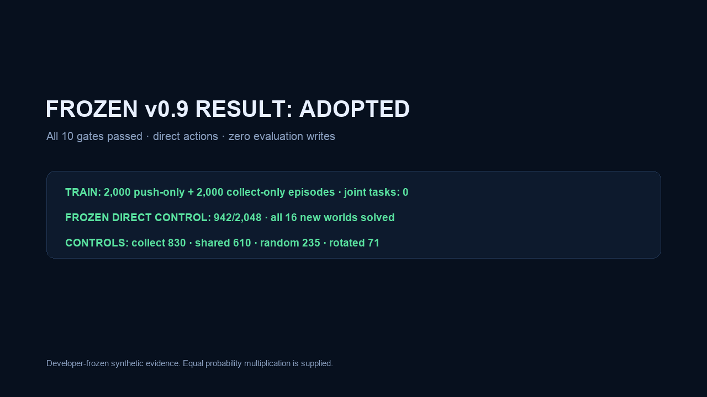

**[Watch all 16 frozen direct-control traces](https://github.com/JoffeeLin/bpc-sokoban-demo/releases/download/v9.0.0/bpc_direct_composition_v09_16_worlds.mp4)**

**[View the v0.9 result and video on X](https://x.com/JoffeeLin/status/2101700819158732821)**

The equal probability product is supplied, not autonomously invented. This is
bounded synthetic cross-task control—not arbitrary planning or AGI.

## v0.8 bridge: exact 64-step cross-task rollout

Before direct control, the v0.7 world function was recursively rolled forward
without teacher forcing. Across two new seeds it completed **6,000/6,000**
64-step trajectories exactly; all `1,681/1,681` trajectories that encountered
joint mechanisms remained exact, versus `1,081/1,681` for condition deletion
and `0/1,681` known by full-context memory. See
[`V08_ROLLOUT_RESULT.md`](V08_ROLLOUT_RESULT.md).

This is open-loop prediction under supplied actions, not planning.

## v0.7 breakthrough: two learned world functions compose

v0.7 trains on two disjoint streams—`150,000` push-only transitions and
`150,000` collect-only transitions—with **zero** local contexts containing both
an object and a mark. Its anonymous fragment chain then predicts two frozen
combined-world seeds exactly:

| Frozen condition | Never-trained joint transitions |
|---|---:|
| Learned fragment chain | **3,795 / 3,795** |
| Condition deletion only | 2,478 / 3,795 |
| Full-context memory known | **0 / 3,795** |

Both old families remained `60,000 / 60,000`, the first holdout repeated
bit-for-bit, and evaluation performed zero model writes. See
[`V07_CROSS_RESULT.md`](V07_CROSS_RESULT.md) and the machine-readable
[`v0.7 result`](artifacts/v07cross/result.json).

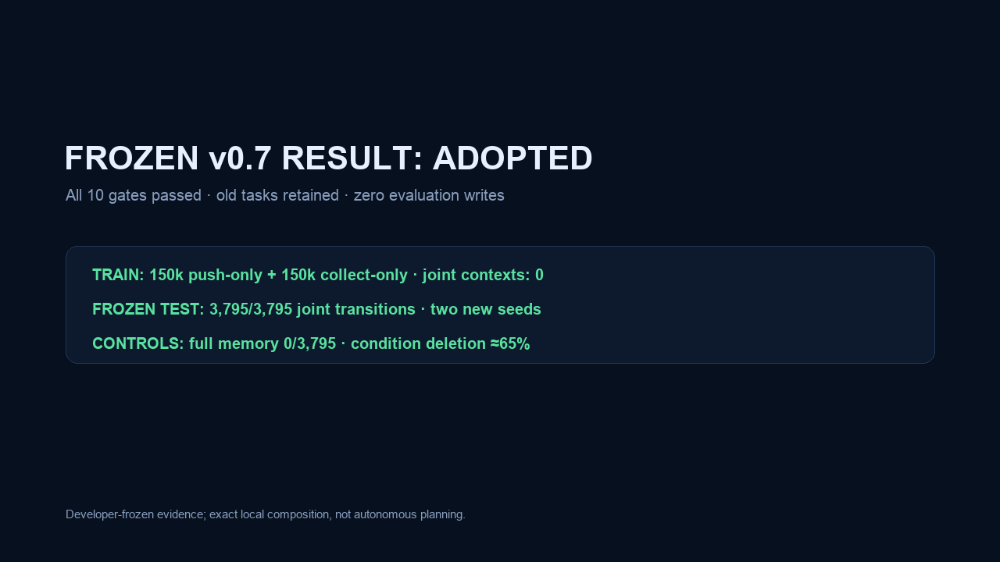

**[Watch all ten frozen joint transition classes](https://github.com/JoffeeLin/bpc-sokoban-demo/releases/download/v7.0.0/bpc_cross_task_v07_10_joint_classes.mp4)**

**[View the v0.7 video on X](https://x.com/JoffeeLin/status/2101692758604079216)**

The supported claim is exact local one-step world-function composition in a
supplied synthetic generator—not planning, a direct policy, or AGI.

## v0.6.1 breakthrough: supplied macro geometry removed

v0.6 learns anonymous push-delta templates from random interaction and uses
them instead of hand-written box-behind/player-behind geometry. Its macro
solver contains no supplied `ACTIONS`, `action ^ 1`, or `moved()` call.

| Frozen condition | Push-template audit | New maps |
|---|---:|---:|
| Learned anonymous geometry | **1,443 / 1,443** | **8 / 8** |
| Rotate templates, same experience | **0 / 1,443** | **0 / 8** |

All solutions replayed under true physics, both new four-box maps passed, and
evaluation performed zero model writes. The original v0.6 runner failed on a
tuple/list serialization assertion before touching the holdout; that failure
is preserved, and v0.6.1 changes only canonical JSON comparison. See
[V061_RESULT.md](V061_RESULT.md) and the machine-readable
[v0.6.1 result](artifacts/v061/result.json).

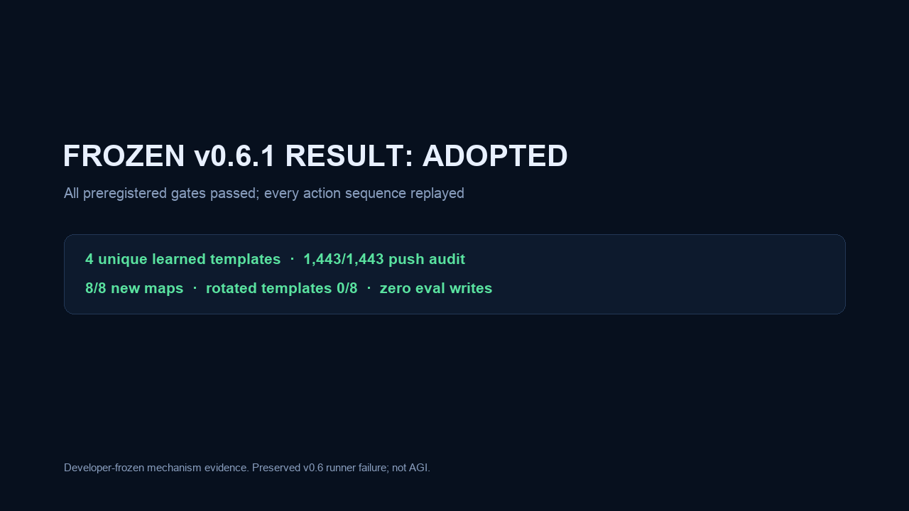

**[Watch all eight frozen holdout replays](https://github.com/JoffeeLin/bpc-sokoban-demo/releases/download/v6.0.0/bpc_learned_geometry_v06_8_unseen.mp4)**

The remaining local action-relative addressing, terminal seeding,
equivalence-class choice, and backward wave are supplied. This is another
hybrid mechanism advance—not cross-task general intelligence or AGI.

## v0.5 breakthrough: supplied reachability removed

v0.5 discovers four inverse action relations from exact round-trip experience,
then uses learned reversible orbits instead of v0.4's hand-written free-space
flood fill. The inverse learner sees only anonymous action indices and exact
before/after microstates; it is not given direction names or inverse pairs.

| Frozen condition | Reach equivalence | New maps |
|---|---:|---:|
| Learned inverse relations | **4,000 / 4,000** | **8 / 8** |
| Wrong inverse, same experience | 7 / 4,000 | **0 / 8** |

The old supplied `reach()` function was deliberately replaced by an exception
before holdout solving. Both unseen four-box maps passed, every sequence replayed
under true physics, and evaluation performed zero model writes. See
[V05_RESULT.md](V05_RESULT.md) and the machine-readable
[v0.5 result](artifacts/v05/result.json).

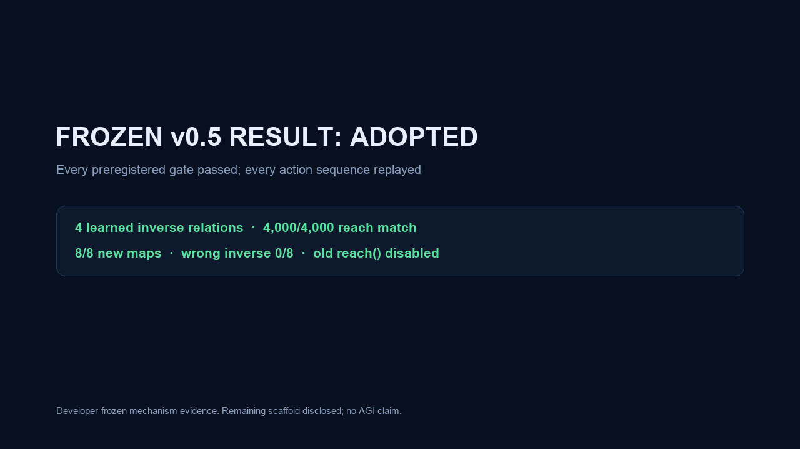

**[Watch all eight frozen holdout replays](https://github.com/JoffeeLin/bpc-sokoban-demo/releases/download/v5.0.0/bpc_reversible_equivalence_v05_8_unseen.mp4)**

**[View the v0.5 video on X](https://x.com/JoffeeLin/status/2101683972887707777)**

The remaining action-displacement interface, macro push-candidate enumeration,
terminal seeding, and backward wave are still supplied. This is a second hybrid
mechanism advance—not direct policy control, autonomous solver discovery,
cross-task general intelligence, or AGI.

## v0.4 breakthrough: one supplied world law removed

The new v0.4 branch restores the historical function-compressed configuration
wave, then replaces its hand-written push-validity decision with a **48-row
local transition probability cube learned only from 240,000 random raw game
transitions**.

In a pre-registered developer-frozen test:

| Frozen condition | Local transitions | Unseen maps |
|---|---:|---:|
| Learned three-cell `F_world` | **40,000 / 40,000** | **12 / 12** |
| Remove the third cell | **0 / 688 push transitions** | **0 / 12** |

All three unseen four-box maps passed even though learning experience contained
only one to three boxes. Every emitted action sequence was replayed through the
true environment, and frozen evaluation performed zero model writes. See
[V04_RESULT.md](V04_RESULT.md) and the machine-readable
[v0.4 result](artifacts/v04/result.json).

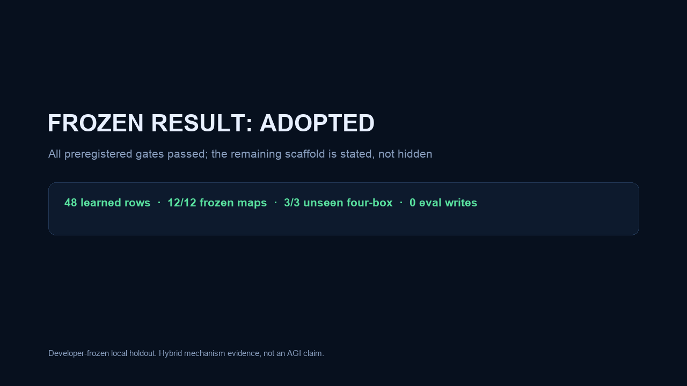

**[Watch all 12 frozen holdout replays](https://github.com/JoffeeLin/bpc-sokoban-demo/releases/download/v4.0.0/bpc_learned_world_v04_12_unseen.mp4)**

The remaining reachability compression, macro candidate geometry, terminal
seeding, backward wave, and raw channels are still supplied. This is a hybrid
mechanism advance—not a pure direct policy, autonomous solver discovery,
cross-task general intelligence, or AGI.

## v7 direct-control result

One non-neural probability-cube controller learned from other layouts and then
directly controlled **10 structurally different, unseen Sokoban levels**. The
developer-frozen v7 result passed every pre-registered gate:

| Frozen condition | Successes | Rate |
|---|---:|---:|
| GeneralBPC v7 | **1098 / 2560** | **42.9%** |
| Remove joint relations | 652 / 2560 | 25.5% |
| Force frame-change fusion | 1077 / 2560 | 42.1% |
| Rotate learned action channels | 198 / 2560 | 7.7% |
| Uniform random | 389 / 2560 | 15.2% |

All ten unseen layouts had successful frozen episodes (`18–256 / 256` each),
and evaluation performed zero learned-state writes. See
[V7_RESULT.md](V7_RESULT.md) and the machine-readable
[result](artifacts/v7/result.json).

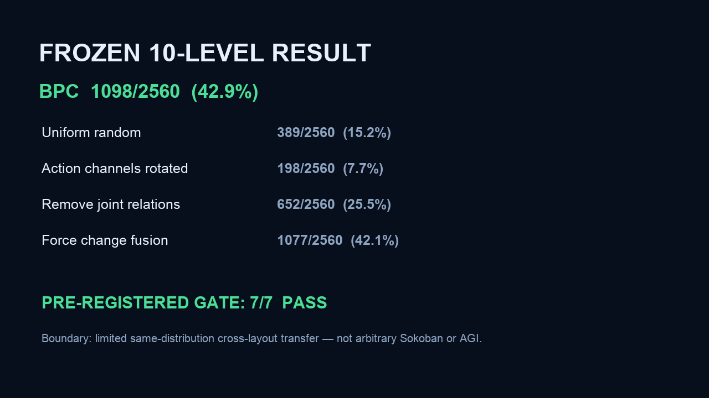

**[Watch all 10 first-success traces](https://github.com/JoffeeLin/bpc-sokoban-demo/releases/download/v3.0.0/bpc_sokoban_v7_10_unseen_levels.mp4)**

**[View the published video on X](https://x.com/JoffeeLin/status/2101668685396230408)**

## What the model sees

- Raw `9×9×6` binary voxels derived from the visible board.
- Four anonymous external action indices.
- No coordinates, object labels, Sokoban rules, route, runtime solver/search,
  neural network, mirror mapping, or evaluation-time learning.

An offline solver only rejects unsolvable maps and fixes a shortest-distance
range. It never returns solution actions to training or inference.

## Mechanism

The encoder discovers low-frequency raw voxel groups by occurrence count, then
emits translation-shared raw identities, directed pair offsets, anonymous joint
geometry, nearby matter, and relation×matter conjunctions. A sparse BPC stores
exact Dirichlet/Beta counts. Successful real paths write action counts back to
the relations that participated; the frozen controller samples a four-way
probability distribution directly.

Training uses a separate high-order BPC only as a behavior policy to collect
experience. The released controller never contains or queries those high-order
features. Removing its joint relation families drops the frozen result by
`17.4` percentage points.

## Jev and classifier.dev influence

The interface borrows two ideas from Jev-style typed decisions: return the full
fixed-choice probability distribution, and keep narrow probabilistic questions
independent. The model exposes a separate `P(raw frame changes | relation,
action)` channel and normalized entropy confidence. Development evidence said
that forcing this channel into action choice hurt, so it remains observable but
is not part of the adopted controller.

The `classifier.dev` skill first triaged 18 de-identified summaries of earlier
BPC mechanisms, then classified 12 candidate replacements for v0.4's supplied
reachability routine and 16 candidates for the next scaffold. It selected
exact learned forward/inverse round trips for v0.5 and ranked learned macro
push deltas as a high-leverage implementable v0.6 experiment. Its response
named `jev-1.13.0`; no classifier output, remote model, or API call enters BPC
training, evaluation, or runtime. Candidate ranking guided development only;
the committed frozen tests, causal controls, and deterministic reruns provide
the evidence.

## Task-agnostic kernel

[`bpc_general_kernel.py`](bpc_general_kernel.py) extracts the reusable part:
variable action count, anonymous feature families, exact probability channels,
confidence, and optional defer. It has no game rules or semantic labels. Its
unit tests cover relation transfer to an unseen identity, channel separation,
and uncertainty deferral:

```bash
python3 -m unittest -v test_general_kernel.py
```

This is a reusable BPC decision kernel, **not evidence of general intelligence**.
Cross-task frozen transfer remains future work.

## Reproduce

Requirements: Python 3.11+, Pillow 12, and `ffmpeg` on `PATH`.

```bash
python3 -m pip install -r requirements.txt
python3 test_learned_geometry_v06.py
python3 experiment_v061_frozen.py
python3 render_v06.py
python3 experiment_v07_cross_frozen.py
python3 render_v07_cross.py
python3 experiment_v08_rollout_frozen.py
python3 experiment_v09_direct_frozen.py
python3 render_v09_direct.py
```

The committed protocol and holdout refuse silent source changes by verifying
their SHA-256 hashes. Generated model and MP4 files are ignored by Git; the MP4
is attached to the GitHub release.

## Evidence boundary

This supports limited cross-layout transfer inside one fixed `9×9`, single-box
distribution. It is a developer-frozen local holdout, not an independent blind
test. It does not establish arbitrary Sokoban, autonomous representation
discovery, cross-task generality, or AGI.

Older failed baselines and v5 evidence remain in the repository for provenance.

## License

MIT
