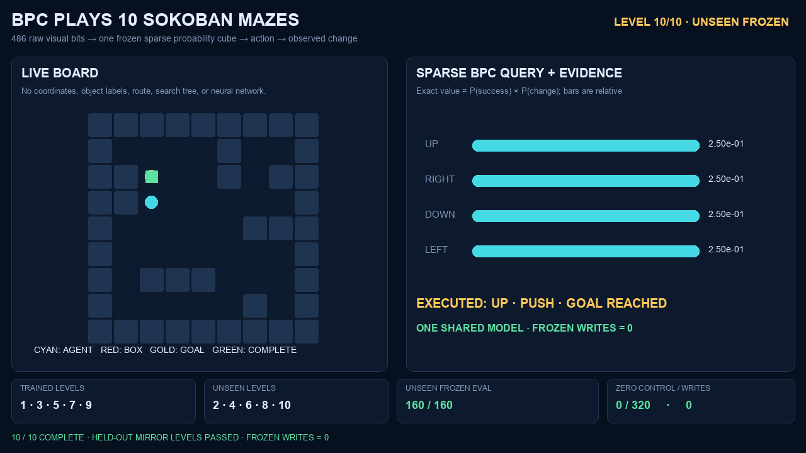

# BPC Sokoban: 10-Level Cross-Layout Transfer

A one-file Python demonstration of one shared Binary Probability Cube (BPC) memory playing ten 9×9 Sokoban mazes. Five layouts are used for training; their five mirrored counterparts are held out until frozen evaluation.



**[Watch the 32-second MP4](https://github.com/JoffeeLin/bpc-sokoban-demo/releases/download/v1.0.0/bpc_sokoban_10_levels.mp4)**

## Result

| Condition | Result |
|---|---:|
| Training layouts | Levels 1, 3, 5, 7, 9 |
| Unseen frozen layouts | Levels 2, 4, 6, 8, 10 |
| Frozen evaluation | 32/32 on every level |
| Unseen frozen total | 160/160 |
| Untrained control | 0/320 |
| Persistent writes during evaluation | 0 |

The model receives a raw 9×9 RGB frame quantized to the two high bits of every channel (486 binary bits) and four anonymous action indices. It receives no coordinates, object labels, route, search tree, Sokoban rules, handcrafted policy, or neural network.

## Mechanism

`BPC` is a sparse `state × action × outcome` probability cube. Each cell holds exact Beta(1,1) Bernoulli counts for:

1. `P(terminal success | raw frame, action)`
2. `P(frame changes | raw frame, action)`

The chosen action maximizes their product. Training is reproducible uniform random exploration.

Before training, the input query declares one generic prior: horizontal reflection equivariance. The lexicographically smaller of a raw frame and its mirror is used as the canonical binary query, while `LEFT` and `RIGHT` are swapped with the frame. No game object is detected or labeled by this transform.

## Evidence boundary

This is held-out cross-layout transfer under a built-in mirror-equivariance prior. It is **not** arbitrary unseen-maze generalization, planning evidence, a general Sokoban solver, a frozen blind result, or AGI. The five obstacle families occur on the training side; only their mirrored layouts are held out.

The full machine-readable result, model hash, seeds, and per-level controls are in [`artifacts/result.json`](artifacts/result.json).

## Run

Requirements: Python 3.11+, Pillow 12, and `ffmpeg` on `PATH`.

```bash
python3 -m pip install -r requirements.txt
python3 bpc_sokoban.py all
```

Or run the stages separately:

```bash
python3 bpc_sokoban.py train
python3 bpc_sokoban.py test
python3 bpc_sokoban.py record
```

Outputs:

- `artifacts/result.json` — raw evidence and scope boundary
- `artifacts/model.pkl` — generated shared model (ignored by Git)
- `artifacts/bpc_sokoban_10_levels.mp4` — generated video (release asset)
- `artifacts/poster.png` — final held-out success frame

## License

MIT
